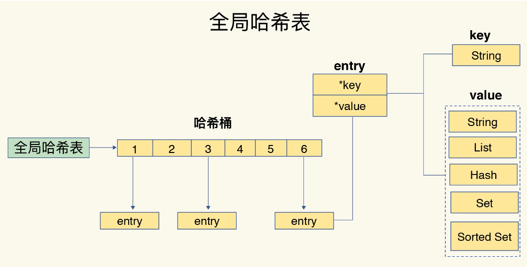
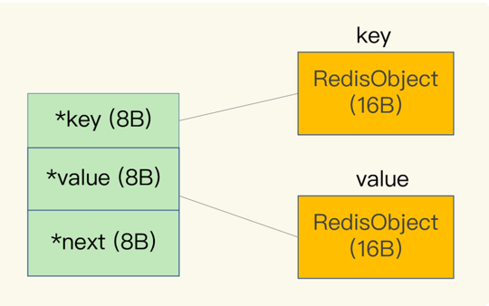

## 序言
Redis 是一个键值数据库，基本的实现是一个**哈希表**，其中键是`String`类型，值支持多种数据类型，其中最基本的、常用的有 `String、List、Hash、Set、SortedSet`。

### 哈希冲突
采用的是链式地址法，所以每个`entry`包括三个部分

- key指针：8字节
- value指针：8字节
- next指针：8字节

### 扩容策略
Redis 默认使用两个全局哈希表：哈希表1和哈希表2。一开始插入数据时，默认使用哈希表1，此时哈希表2没有分配空间，随着数据增多，超过某个阈值时，将会触发扩容 `rehash`
1. 给哈希表2分配一个更大的内存空间，比如是哈希表1的2倍
2. 将哈希表1中的数据重新映射并拷贝到哈希表2
3. 释放哈希表1的空间

其中步骤2是比较麻烦的，为了保证不阻塞主线程，采用扩容策略的是渐进式hash，将一次性大量数据迁移的开销分摊到每个请求。

- 如果有新请求，触发一个数据重新哈希并拷贝
- 如果没有，由定时线程重新哈希并拷贝

### RedisObject
`RedisObject`是所有数据类型的抽象数据结构。

如下图，每个 `RedisObject`占16个字节，前8个字节是元数据，后8个字节一般是指向具体数据类型数据结构的指针。

