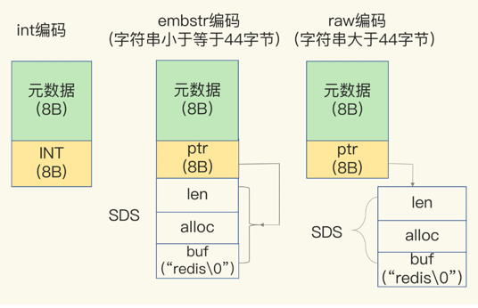

### String

#### 底层数据结构
简单动态字符串，简称 `SDS`，有三种编码方式

- int编码：当保存的是 Long 类型整数时，直接存储在`RedisObject`中
- embstr编码：当保存的是字符串数据，且长度`<=44`字节，`RedisObject`中的元数据、指针和`SDS`是一块连续的内存空间，避免内存碎片
- raw编码：`RedisObject`和`SDS`不布局在一起，通过指针联系。

如上图，`SDS`的数据结构分为3部分
- len：4字节，表示 buf 的长度
- alloc：4字节，表示 buf 实际申请的长度
- buf：字节数组，保存实际数据，以 `\0` 字符结束

#### 适用场景
`String`是个万金油类型，不管客户端是什么数据类型，只要转化为字符串，都可以使用这个数据类型。

从节省空间的角度考虑，有两个优化手段
1. 客户端使用高效的字符串工具序列化和反序列化字符串
2. 如果值所占字节大小 `<=8B`，可以考虑使用压缩列表实现

### List
#### 底层数据结构

- 压缩列表
1. 列表中保存的数据都小于64字节
2. 列表中的数据个数小于 512
- 双向链表

### 应用场景
- 简单的消息队列，时间复杂度为O(1)

### hash
#### 底层数据结构
- 压缩列表
1. 键值的大小都要小于 64 个字节
2. 列表中的数据个数小于 512
- 哈希表

### set
#### 底层数据结构
- 有序数组
1. 存储的数据为整数
2. 集合的数据个数小于 512
- 哈希表

#### 适用场景

### sortedset

#### 底层数据结构
- 压缩列表
1. 所有的数据大小都要小于64字节
2. 集合数据个数小于128
- 跳表
