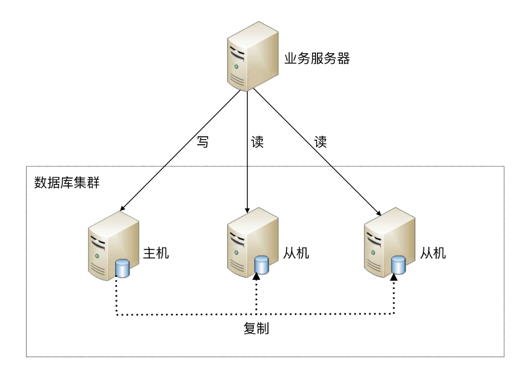

### 物理部署架构图

- 主库主要负责写请求
- 从库主要负责读请求

### 解决的问题
对于度多写少的系统，应用层已经优化到极致，然而读请求的性能还是不能达到要求时，这个时候可以考虑对数据库进行读写分离。

### 引入的新问题
在软件开发领域，使用一个解决方案解决一个问题时，往往会引入新的问题。

读写分离也不例外，它虽然能够提高读请求的性能，但是也引入了两个新的问题

1. 主从复制延迟
2. 分配机制
3. 成本问题

#### 主从复制延迟
从库同步主库的数据，一定会存在延迟，存在数据不一致问题。

如果业务上要保证数据的强一致性，那么一般有3个解决方案

1. 写请求之后的读请求路由到主节点
2. 读从节点失败后再读一次主节点
3. 关键业务的读写请求都指向主节点，其它采用读写分离

#### 分配机制
将读写操作区分开来，然后访问不同的数据库服务器，一般有两种方式

1. 程序封装：实现简单，不通用，开源方案有`ShardingSphere-JDBC`
2. 中间件封装：实现复杂，通用，开源方案有`ShardingSphere-Proxy`

#### 成本问题
读写分离意味着要引入新机器，增加硬件成本。

