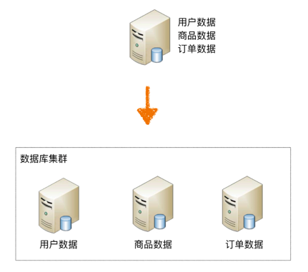

## 序言
当数据达到一定规模后，单台数据库服务器的存储能力会成为系统的性能瓶颈，有以下表现

1. 读写性能下降，即使存在索引，索引也会变的很大，性能同样会下降
2. 数据库备份和还原变慢
3. 丢失数据的风险变高

所以单台数据库服务器存储的数据不能太大，要限制在一定氛围内，如果超过这个范围，就要考虑存储到不同的服务器。 

## 分库
### 物理部署架构图

> 一个功能模块对应一个数据库

### 解决的问题
分散数据库存储压力，提高数据库读写性能

### 引入的新问题

1. join要跨库：只能在应用层实现
2. 事务问题：分布式事务
3. 成本问题：需要新增机器

### 如何解决分表引入的新问题

1. 程序封装：实现简单，不通用，开源方案有`ShardingSphere-JDBC`
2. 中间件封装：实现复杂，通用，开源方案有`ShardingSphere-Proxy`
